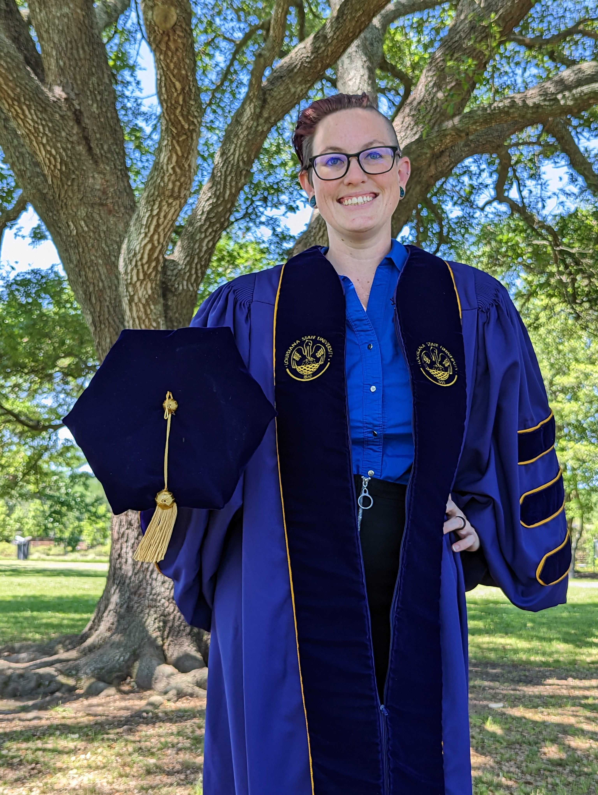

My name is Lauryn Burleigh. I prefer to go by L or Burleigh and use any pronoun. I am the creator of the Between The Lobes site. I'm a big animal person. I have a Border-Collie/Lab mix named Roxy and an American Pitbull Terrier named Bronson, an American Staffordshire Terrier named Tina, a bearded dragon named Severus, and a ball python named Brighid. I also have two rabbits, Cal and Moo. 

I began my graduate career in Dr. Steven Greening’s Cognitive Neuroscience of Affect and Psychopathology Lab (CNAPs Lab) at Louisiana State University (LSU) in Baton Rouge, LA in August 2016 to further my understanding and research of the human brain using neuroimaging techniques. Upon Dr. Greening's move back home to Canada in August 2020, I joined Dr. Chris Cox's ReLearn Lab, also at LSU, to continue my neuroscience research and further my computational and modeling skills, having began my machine learning adventures on fMRI data with Dr. Cox's collaborations while in Dr. Greening's lab. 

My graduate research focused on emotions and how they impact cognitive processes, primarily investigating the neural mechanisms of fear during imagination and perception. I also have a strong interest in meditation, computational neuroscience, and statistical analyses including machine learning algorithms. I have a passion for data, research, and making them, as well as science, approachable and accessible.

The software I use includes, but is not limited to: Python, bash, fsl, R, Matlab, and Overleaf (LaTex).

Since 2018, I have continuously taught undergraduate and graduate statistics courses at LSU using SPSS and R, and am currently building an A/B testing in R course for DataCamp. Beyond the null hypothesis statistic tests in these courses, I have experience and a strong interest in Bayesian statistics, machine and transfer learning, and multi-variate analyses.

Otherwise, I enjoy yoga and am a certified yoga instructor. I also like to spend my [limited] spare time camping and hiking with my pups and dragon, or doing various DIY crafts! 